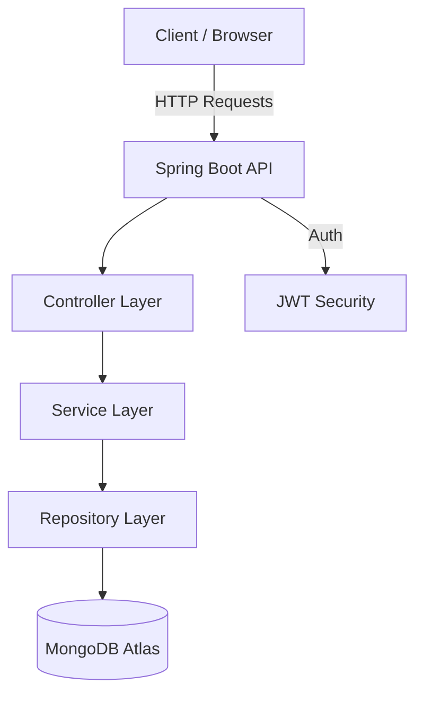
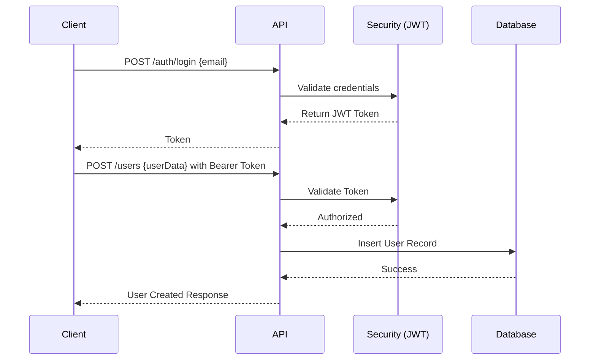

# Backend Technical Assessment: User Service API

This repository contains my submission for the **Backend Developer Technical Assessment**.  
It implements a **RESTful API** for managing user profiles and includes a **pseudocode solution for dynamic delivery slot allocation**.

The project fulfills all requirements of the assessment and implements several bonus objectives such as documentation, testing, and deployment preparation.

---

## Table of Contents
- [Features](#features)
- [Project Structure](#project-structure)
- [Technologies Used](#technologies-used)
- [Setup and Installation](#setup-and-installation)
- [Usage](#usage)
  - [API Documentation (Swagger UI)](#api-documentation-swagger-ui)
  - [Authentication Flow](#authentication-flow)
  - [Example Requests](#example-requests)
- [Testing](#testing)
- [Task 2: Delivery Slot Pseudocode](#task-2-delivery-slot-pseudocode)
- [Deployment](#deployment)
- [Challenges Faced](#challenges-faced)
- [Architecture & Flow Diagrams](#architecture--flow-diagrams)

---

## Features
- **CRUD Operations:** Create, Read, Update, Delete user profiles.
- **Secure Endpoints:** All user operations secured with JWT authentication.
- **Validation:** Server-side checks for required fields, email format, and uniqueness.
- **Global Error Handling:** Returns clear responses for `400` (bad input), `404` (not found), `409` (duplicate).
- **Pagination & Filtering:** Paginated retrieval with optional filtering by age.
- **Database Seeding:** Default `admin` user created at startup for first-time access.
- **Swagger UI Docs:** Interactive API documentation included.
- **Testing:** Unit + integration tests using JUnit & Mockito.
- **Modular Codebase:** Clean architecture for maintainability.

---

## Project Structure
```
├── config/       # Security, JWT, beans, database initializer
├── controller/   # REST controllers (UserController, AuthController)
├── dto/          # Data Transfer Objects for requests/responses
├── exception/    # Custom exceptions & global handler
├── model/        # MongoDB models (User)
├── repository/   # MongoDB repositories
└── service/      # Business logic (UserService, AuthService)
```

---

## Technologies Used
- **Java 17**
- **Spring Boot 3**, **Spring Security 6**
- **MongoDB Atlas** (database)
- **JWT** for token-based auth
- **Lombok** for reducing boilerplate
- **JUnit 5 & Mockito** for testing
- **SpringDoc OpenAPI** (Swagger UI)
- **Docker** for containerization
- **Maven** build tool

---

## Setup and Installation

### Prerequisites
- Java 17+
- Maven 3.6+
- MongoDB instance (local or [Atlas](https://www.mongodb.com/cloud/atlas/register))

### Steps
1. **Clone repo**
   ```bash
   git clone <repo-url>
   cd user-service
   ```

2. **Configure environment**
   (for easier testing, I included `application.properties` with default values)
   ```properties
   spring.application.name=user-service
   server.port=8080

   spring.data.mongodb.uri=${MONGO_URI:mongodb+srv://...}
   jwt.secret.key=${JWT_SECRET:...}
   jwt.expiration.ms=86400000
   ```

3. **Build project**
   ```bash
   mvn clean install
   ```

4. **Run locally**
   ```bash
   mvn spring-boot:run
   ```
   Application starts at **http://localhost:8080**

---

## Usage

### API Documentation (Swagger UI)
Visit: **http://localhost:8080/swagger-ui.html**

You can view and test all endpoints directly in the browser.

### Authentication Flow
- On first run, a default admin user is seeded:
  - **Email:** `admin@example.com`
- Obtain a JWT via:
  ```http
  POST /auth/login
  {
    "email": "admin@example.com"
  }
  ```

Use the returned token in the `Authorization: Bearer <token>` header.

### Example Requests
**Create User**
```http
POST /users
Authorization: Bearer <JWT>
Content-Type: application/json

{
  "name": "Jane Doe",
  "email": "jane.doe@example.com",
  "age": 28
}
```

---

## Testing
- **Unit tests** → service layer logic (Mockito)
- **Integration tests** → API endpoints with MockMvc

Run all tests:
```bash
mvn test
```

---

## Task 2: Delivery Slot Pseudocode
The pseudocode for **dynamic delivery slot allocation** is included in  
[`delivery_slots_pseudocode.md`](./delivery_slots_pseudocode.md).

It ensures:
- No overbooking  
- Dynamic assignment based on availability  
- Suggesting alternatives when slots are full  

---

## Deployment
The project is deployment-ready:

- **Docker** → build and run locally or in cloud  
  ```bash
  docker build -t user-service .
  docker run -p 8080:8080     -e MONGO_URI="<mongo-uri>"     -e JWT_SECRET="<jwt-secret>"     user-service
  ```

- **Heroku** → includes `Procfile` + `system.properties`  
- **Render** → compatible via provided Dockerfile  

> ⚠️ Live deployment not available because free cloud providers require a credit card.

---

## Challenges Faced
- **First user creation problem:** Resolved by seeding a default admin user at startup.
- **Deployment limitation:** Could not deploy live due to credit card requirements on Heroku/Render/AWS. Prepared configs are included for quick deployment once credentials are available.

---

## Architecture & Flow Diagrams

### High-Level Architecture

```mermaid
flowchart TD
    Client[Client / Browser] -->|HTTP Requests| API[Spring Boot API]
    API --> Controller[Controller Layer]
    Controller --> Service[Service Layer]
    Service --> Repository[Repository Layer]
    Repository --> DB[(MongoDB Atlas)]
    API -->|Auth| JWT[JWT Security]
```

### Request Flow Example

```mermaid
sequenceDiagram
    participant C as Client
    participant A as API
    participant S as Security (JWT)
    participant D as Database

    C->>A: POST /auth/login {email}
    A->>S: Validate credentials
    S-->>A: Return JWT Token
    A-->>C: Token

    C->>A: POST /users {userData} with Bearer Token
    A->>S: Validate Token
    S-->>A: Authorized
    A->>D: Insert User Record
    D-->>A: Success
    A-->>C: User Created Response
```
